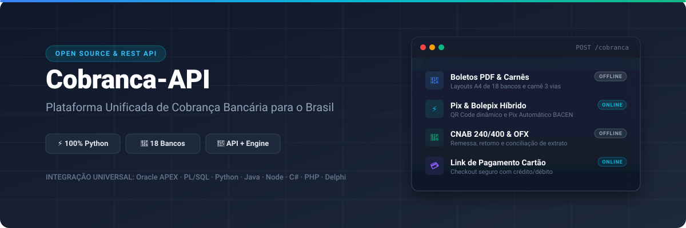
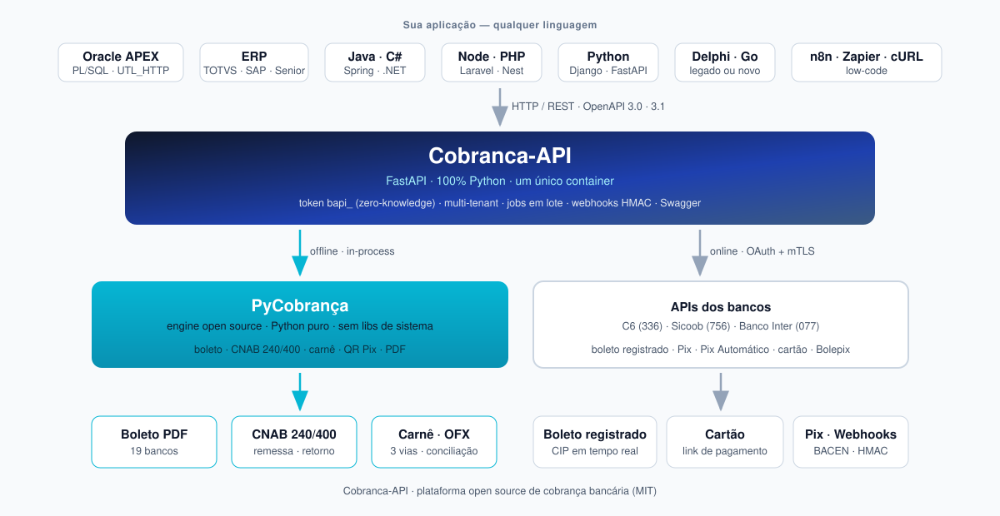
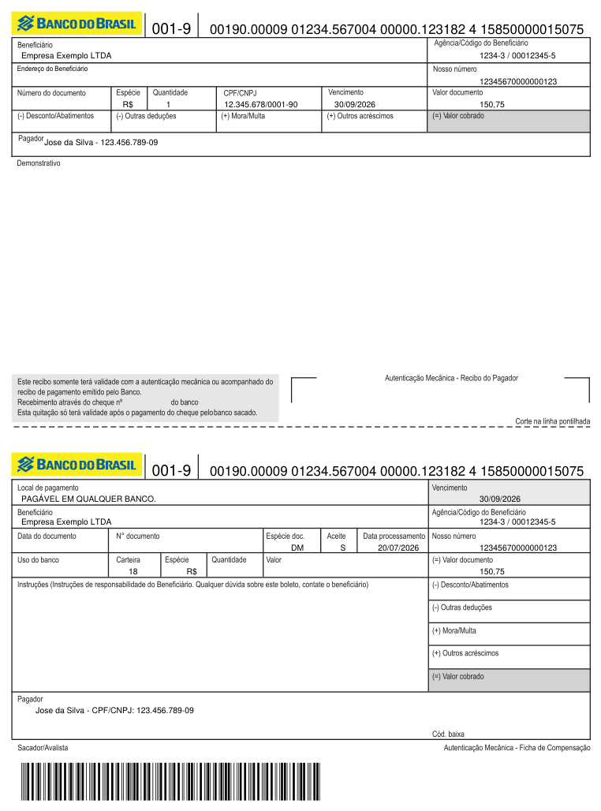
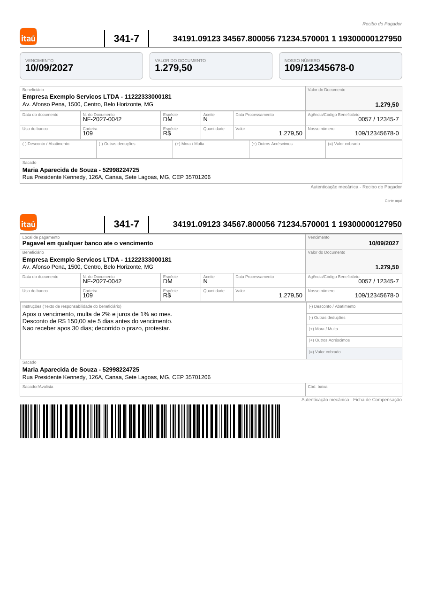
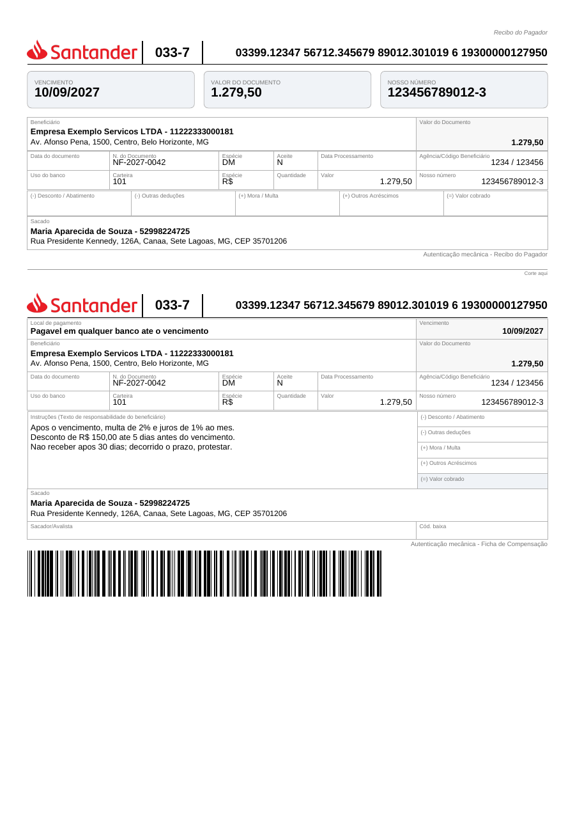
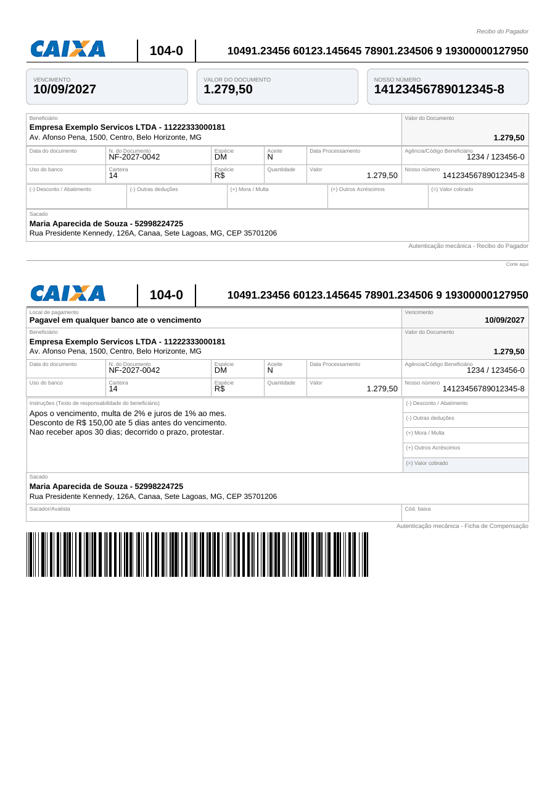
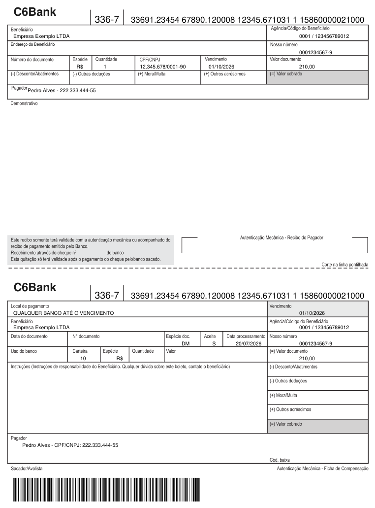
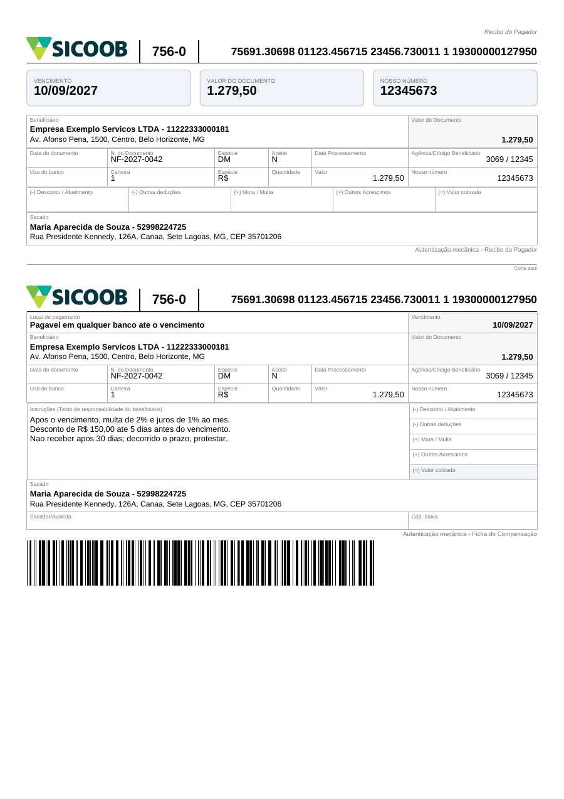
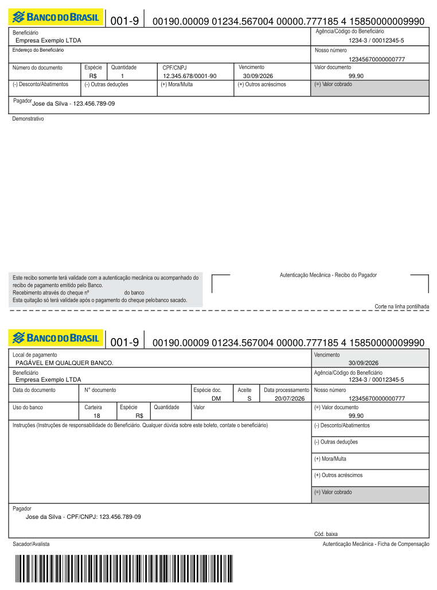
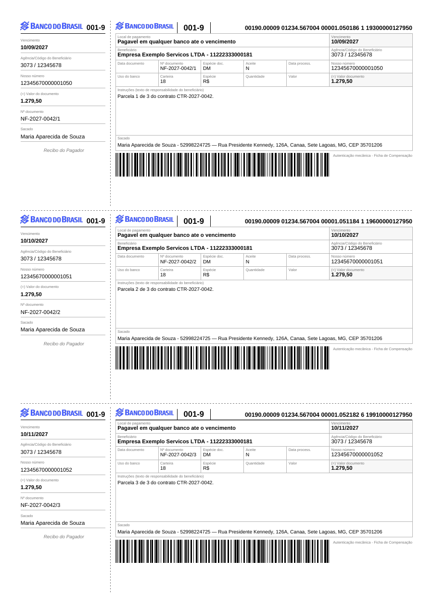

<p align="center">
  
</p>

<h1 align="center">Plataforma Open Source de Cobrança Bancária para o Brasil</h1>

<h3 align="center">API REST + PyCobrança + PIX + CNAB + OFX</h3>

<p align="center">
  Uma plataforma única para <strong>emissão de boletos</strong>, <strong>remessas CNAB</strong>,
  <strong>processamento de retorno</strong>, <strong>Pix</strong>, <strong>Pix Automático</strong>
  e <strong>integração com as APIs dos bancos brasileiros</strong>.
  <br />
  Consuma de <strong>qualquer linguagem</strong> via HTTP — Python, Java, Node, PHP, C#, Go,
  Delphi, Oracle APEX e PL/SQL.
</p>

<p align="center">
  <a href="https://boleto-cnab-api.onrender.com/docs"><strong>Swagger do Gateway →</strong></a>
  &nbsp;·&nbsp;
  <a href="https://boleto-cnab-api.onrender.com/api/docs"><strong>Swagger Offline →</strong></a>
  &nbsp;·&nbsp;
  <a href="https://github.com/Maxwbh/pyCobranca"><strong>Engine PyCobrança →</strong></a>
  <br /><br />
  <a href="#quick-start">Quick Start</a>
  ·
  <a href="#arquitetura">Arquitetura</a>
  ·
  <a href="#casos-de-uso">Casos de uso</a>
  ·
  <a href="./docs/README.md">Documentação</a>
  ·
  <a href="https://github.com/Maxwbh/cobranca-api/issues">Reportar Bug</a>
  <br /><br />
  <sub>
    Os links de Swagger apontam para um <strong>ambiente de demonstração</strong>
    (Render free tier), que pode sair do ar ou mudar de endereço — não é produção.
  </sub>
</p>

<p align="center">
  
  
  
  
  
  
  <br />
  
  
  
  
  
  
</p>

<p align="center">
  <a href="https://render.com/deploy"></a>
</p>

> **O que esta plataforma entrega:** gateway para as **APIs dos bancos** (boleto
> registrado, Pix, Pix Automático, conciliação) · **engine offline** de boleto,
> CNAB 240/400 e carnê para **18 bancos** · **parsing de OFX** · **lote
> assíncrono** com artefatos assinados · tudo por **REST**, em **um único
> container 100% Python**.

---

## ⚡ Powered by PyCobrança

A Cobranca-API usa a **[PyCobrança](https://github.com/Maxwbh/pyCobranca)** — biblioteca
open source **100% Python** — como **engine oficial de cobrança**, responsável por:

<table>
<tr>
<td>

- Geração de **boletos** (PDF)
- **CNAB 240** (remessa e retorno)
- **CNAB 400** (remessa e retorno)

</td>
<td>

- **Carnês** 3 vias A4
- Cálculo de **nosso número** e DV
- **Linha digitável** e **código de barras**

</td>
<td>

- **PIX / Bolepix** (EMV, QR)
- Segmento PIX no CNAB
- Sem dependências de sistema

</td>
</tr>
</table>

> A PyCobrança também pode ser usada **diretamente em aplicações Python**, sem esta API.
> ➡ **[github.com/Maxwbh/pyCobranca](https://github.com/Maxwbh/pyCobranca)**

### Cobranca-API × PyCobrança — qual usar?

| Recurso | Cobranca-API | PyCobrança |
|---|:---:|:---:|
| **REST API** (qualquer linguagem) | ✅ | — |
| **Docker** / deploy pronto | ✅ | — |
| **Gateway bancário** (C6, Sicoob: boleto registrado, Pix, conciliação) | ✅ | — |
| **Lote assíncrono** (jobs, artefatos, webhook) | ✅ | — |
| **Cofre de credenciais** multi-tenant | ✅ | — |
| Uso **direto em Python** (import) | ✅ | ✅ |
| Boletos · CNAB 240/400 · PIX · OFX | ✅ | ✅ |

**Regra simples:** app Python que roda tudo local → **PyCobrança**. Qualquer outra
linguagem, ou precisa falar com a **API do banco** → **Cobranca-API**.

---

## Arquitetura

<p align="center">
  
</p>

**Dois caminhos, um contrato:** o **offline** roda a engine PyCobrança dentro do
próprio processo (sem rede, sem sidecar); o **online** fala com a API do banco
(OAuth + mTLS) para cobrança registrada, Pix e conciliação.

---

<a name="casos-de-uso"></a>

## Casos de uso

| Cenário | Como resolve |
|---|---|
| **ERP** (TOTVS, Senior, Sankhya, SAP, Oracle EBS) precisa emitir boleto | `POST /cobranca` — registrado no banco ou offline, mesmo contrato |
| **Oracle APEX / PL/SQL** sem biblioteca de boleto | Chamada REST via `APEX_WEB_SERVICE`/`UTL_HTTP` — **[exemplos prontos](./examples/oracle/)** (pacote PL/SQL + páginas APEX), sem instalar nada no banco |
| **Delphi / C# / Java legado** | HTTP puro; PDF em binário ou base64 |
| Cobrança **recorrente** (aluguel, mensalidade) | Pix Automático + carnê 3 vias |
| **Fechamento em lote** (100–200 boletos) | `POST /jobs/boletos` → 202 + zip com PDFs e manifesto |
| **Conciliação** do extrato | `POST /api/ofx/parse` extrai `nosso_numero` do memo |
| Enviar **remessa** e ler **retorno** do banco | `POST /api/remessa` · `POST /api/retorno` (ou `/jobs/cnab/remessas` em lote) |

---

<a name="por-que-existe"></a>

## Por que este projeto existe

Emitir cobrança no Brasil exige juntar peças que quase nunca vêm juntas: layout
de boleto por banco, CNAB 240/400 com particularidades de cada convênio, QR Pix
no padrão BACEN, conciliação por OFX e, ainda por cima, a API REST de cada
instituição — cada uma com seu OAuth, seu mTLS e seu vocabulário.

A **Cobranca-API** entrega tudo isso atrás de **um contrato REST único**, num
**único container**, em **100% Python**. Quem chama não precisa saber se o
boleto foi gerado localmente pela engine **[PyCobrança](https://github.com/Maxwbh/pyCobranca)**
ou registrado na API do banco — o payload é o mesmo.

A proposta é ser a **plataforma open source brasileira que unifica APIs
bancárias, emissão de boletos, Pix, CNAB e OFX**, utilizável a partir de
qualquer linguagem: Oracle APEX, Java, C#, Node, PHP, Delphi, Go ou Python.

---

## 🖼️ Boletos gerados pela API

Exemplos **reais gerados pela API** (engine pyCobrança, Python puro), um por banco:

<p align="center">
  
  
  
  
</p>
<p align="center">
  
  
  
  
</p>

<p align="center">
  <sub>
    <strong>Banco do Brasil</strong> · <strong>Itaú</strong> · <strong>Santander</strong> · <strong>Caixa</strong> ·
    <strong>C6 Bank</strong> · <strong>Sicoob</strong> ·
    <strong>Bolepix</strong> (boleto híbrido com QR Pix) · <strong>Carnê</strong> (3 vias A4)
    &nbsp;— e mais 12 bancos.
  </sub>
</p>

> 💡 Todos acima saíram de uma chamada `GET /api/boleto?bank=<banco>&type=pdf&data=<json>` na
> [demo ao vivo](https://boleto-cnab-api.onrender.com/api/docs) — instância de
> demonstração no plano gratuito do Render. A URL vem do nome do serviço e **não é
> fixa**: na sua instalação, use a que o Render mostrar (veja [DEPLOY.md](./DEPLOY.md)).

## Por que usar?

Se você precisa **gerar boletos**, **processar arquivos CNAB** ou **conciliar pagamentos via OFX** no Brasil, esta API resolve tudo via HTTP — sem instalar nada além de um container.

| Problema | Solução |
|----------|---------|
| "Preciso gerar boletos em Python/Node/PHP" | API REST — chame de qualquer linguagem |
| "Preciso de CNAB 240/400 para enviar ao banco" | `POST /api/remessa` gera o arquivo pronto |
| "Preciso processar o retorno do banco" | `POST /api/retorno` parseia e retorna JSON |
| "Preciso conciliar pagamentos com extrato" | `POST /api/ofx/parse` extrai nosso_numero do OFX |
| "Preciso de boleto com QR Code PIX" | Campo `emv` no payload + `pix=true` na remessa |
| "Não quero dependências de sistema" | Engine **100% Python** (pyCobrança) — PDF sem GhostScript |
| "Preciso saber quais bancos/formatos são suportados" | `GET /api/bancos` retorna tudo dinamicamente |

### Diferenciais

- **100% Python** — Engine [pyCobrança](https://github.com/Maxwbh/pyCobranca) **in-process**: um runtime, um container, sem sidecar
- **18 bancos offline** — boleto + CNAB (15 bancos com remessa, 26 combinações banco×layout, 7 com segmento PIX)
- **Boleto registrado via API** — C6 e Sicoob: Pix, Bolepix, Pix Automático, extrato e conciliação
- **Lote assíncrono** — `POST /jobs/boletos` e `/jobs/cnab/remessas`: 202 + `job_id`, falha por item isolada, artefatos com `sha256` e webhook de conclusão
- **Credenciais zero-knowledge** — token `bapi_`; o servidor não decifra sem ele
- **Carnê 3-vias** — N parcelas em PDF A4
- **Swagger UI** — interativo em `/docs` (gateway) e `/api/docs` (offline)
- **Docker ready** — imagem única, deploy em 1 minuto no Render, Railway ou qualquer cloud

---

<a name="quick-start"></a>

## Quick Start

```bash
git clone https://github.com/Maxwbh/cobranca-api.git && cd cobranca-api

# Docker (serviço único 100% Python)
docker compose up --build

# Swagger UI
open http://localhost:8000/docs       # gateway REST (C6/Sicoob, Pix)
open http://localhost:8000/api/docs   # offline (boleto/CNAB/OFX)
```

### Gerar boleto (1 chamada = PDF + dados)

```bash
curl "http://localhost:8000/api/boleto?bank=banco_brasil&type=pdf&include_data=true&data=$(python3 -c "
import json; print(json.dumps({
    'agencia': '3073', 'conta_corrente': '12345678', 'convenio': '1234567',
    'carteira': '18', 'nosso_numero': '123', 'cedente': 'Empresa LTDA',
    'documento_cedente': '11222333000181', 'sacado': 'Joao da Silva',
    'sacado_documento': '52998224725', 'valor': 1500.0,
    'data_vencimento': '2027-12-30'
}))"
)" | python3 -c "
import sys, json, base64
data = json.load(sys.stdin)
print(f'Nosso Numero: {data[\"nosso_numero\"]}')
print(f'Formatado:    {data[\"nosso_numero_formatado\"]}')
print(f'Cod. Barras:  {data[\"codigo_barras\"]}')
with open('boleto.pdf', 'wb') as f:
    f.write(base64.b64decode(data['content_base64']))
print('PDF salvo: boleto.pdf')
"
```

---

## Endpoints

| Endpoint | Método | O que faz |
|----------|:------:|-----------|
| **`/api/docs`** | GET | Swagger UI interativa |
| **`/api/bancos`** | GET | 18 bancos com capacidades (boleto, CNAB, PIX, carteiras) |
| `/api/boleto/data` | GET | Dados calculados: nosso_numero, código barras, linha digitável |
| `/api/boleto` | GET | Gerar PDF. `include_data=true` → JSON + base64 |
| `/api/boleto/multi` | POST | Múltiplos boletos em 1 arquivo |
| `/api/remessa` | POST | Remessa CNAB 240/400. `pix=true` → com segmento PIX |
| `/api/retorno` | POST | Processar retorno CNAB → JSON |
| `/api/ofx/parse` | POST | Extrato OFX → JSON com nosso_numero extraído |
| `/api/render/boleto` | POST | Corpo JSON → dados + PDF base64 (uso interno) |

### Gateway REST (cobrança online e lote)

| Endpoint | Método | O que faz |
|----------|:------:|-----------|
| **`/docs`** | GET | Swagger do gateway |
| `/bancos` | GET | Catálogo com capacidades reais e esquema de credenciais por banco |
| `/credenciais` | POST | Credenciais do banco → token `bapi_` (zero-knowledge) |
| `/cobranca` | POST/GET/PUT/DELETE | Boleto registrado (C6/Sicoob) ou offline, conforme `provider` |
| `/carne` | POST | Carnê 3-vias (registra N parcelas e monta o PDF) |
| `/pix` · `/bolepix` · `/pix-automatico` | — | Pix BACEN, boleto híbrido e débito recorrente |
| `/extrato` · `/conciliacao/*` | GET | Extrato PJ e recebíveis/transações |
| **`/jobs/boletos`** | POST/GET | Lote assíncrono: 202 + `job_id`, itens, artefatos (`sha256`, zip) |
| **`/jobs/cnab/remessas`** | POST/GET | Remessa em lote com **sublotes determinísticos** (1 arquivo por banco/carteira) |
| `/webhooks/{banco}` | POST | Entrada de notificações do banco → push assinado (HMAC) ao consumidor |
| `/api/render/carne` | POST | Corpo JSON → carnê 3-vias A4 em PDF base64 |
| `/api/render/fatura` | POST | Corpo JSON → fatura (itens/blocos) + boleto em PDF base64 |
| `/api/render/remessa` | POST | Corpo JSON → conteúdo CNAB |

<details>
<summary>Ver todos os 18 endpoints</summary>

| Endpoint | Método | Descrição |
|----------|:------:|-----------|
| `/api/health` | GET | Health check |
| `/api/info` | GET | Versão e configuração |
| `/api/metadata` | GET | Metadados da API e gem |
| `/api/bancos` | GET | Capacidades por banco |
| `/api/boleto/validate` | GET | Validar dados do boleto |
| `/api/boleto/data` | GET | Dados calculados |
| `/api/boleto/nosso_numero` | GET | Apenas nosso_numero |
| `/api/boleto` | GET | Gerar boleto (PDF/JPG/PNG/TIF) |
| `/api/boleto/multi` | POST | Múltiplos boletos |
| `/api/remessa` | POST | Remessa CNAB |
| `/api/retorno` | POST | Retorno CNAB |
| `/api/ofx/parse` | POST | Parsing OFX |
| `/api/render/boleto` | POST | Renderizar boleto (JSON → dados + PDF base64) |
| `/api/render/carne` | POST | Renderizar carnê 3-vias A4 (JSON → PDF base64) |
| `/api/render/fatura` | POST | Renderizar fatura + boleto (JSON → PDF base64) |
| `/api/render/remessa` | POST | Renderizar remessa CNAB (JSON → texto) |
| `/api/docs` | GET | Swagger UI |
| `/api/openapi.json` | GET | Spec OpenAPI (JSON) |
| `/api/openapi.yaml` | GET | Spec OpenAPI (YAML) |

</details>

---

## Bancos Suportados

| Banco | Cód | Boleto | Remessa | Retorno | PIX |
|-------|:---:|:------:|:-------:|:-------:|:---:|
| Banco do Brasil | 001 | ✅ | 400 + 240 | 400 | ✅ |
| Santander | 033 | ✅ | 400 + 240 | 400 + 240 | ✅ |
| Caixa | 104 | ✅ | 240 | 240 | ✅ |
| Bradesco | 237 | ✅ | 400 | 400 | ✅ |
| **Banco C6** | **336** | ✅ | 400 | 400 | ✅ |
| Itaú | 341 | ✅ | 400 + 444 | 400 | ✅ |
| Sicredi | 748 | ✅ | 240 | 240 | ✅ |
| Sicoob | 756 | ✅ | 400 + 240 | 240 | ✅ |
| Banrisul | 041 | ✅ | 400 | 400 | — |
| Unicred | 136 | ✅ | 400 + 240 | 400 | — |
| + 8 bancos | — | ✅ | — | — | — |

> Use `GET /api/bancos` para capacidades completas em tempo real, incluindo carteiras aceitas e formatos PIX.

---

## Exemplo: Python

```python
import requests, json, base64

API = "http://localhost:8000"

# 1. Gerar boleto com dados + PDF
response = requests.get(f"{API}/api/boleto", params={
    "bank": "sicoob", "type": "pdf", "include_data": "true",
    "data": json.dumps({
        "agencia": "4327", "conta_corrente": "417270",
        "convenio": "229385", "carteira": "1",
        "nosso_numero": "7890", "cedente": "Empresa LTDA",
        "documento_cedente": "11222333000181",
        "sacado": "Joao da Silva", "sacado_documento": "52998224725",
        "valor": 2500.00, "data_vencimento": "2027-12-30"
    })
})
data = response.json()
with open("boleto.pdf", "wb") as f:
    f.write(base64.b64decode(data["content_base64"]))

# 2. Parsear extrato OFX
with open("extrato.ofx", "rb") as f:
    ofx = requests.post(f"{API}/api/ofx/parse", files={"file": f}).json()
for tx in ofx["transacoes"]:
    if tx["nosso_numero"]:
        print(f"{tx['data']} R$ {tx['valor']} nn={tx['nosso_numero']}")
```

### Lote assíncrono (100–200 boletos)

```bash
# 1. Cria o job -> 202 com job_id (processa em background)
curl -X POST http://localhost:8000/jobs/boletos \
  -H 'Content-Type: application/json' -H 'Idempotency-Key: lote-2026-07-25' \
  -d '{"tenant_id":"empresa1","boletos":[{"bank":"banco_brasil","external_id":"F-001", ...}]}'

# 2. Acompanha o estado (completed | partially_completed | failed)
curl "http://localhost:8000/jobs/boletos/$JOB_ID?tenant_id=empresa1"

# 3. Baixa o consolidado (.zip com PDFs + manifesto + erros)
curl "http://localhost:8000/jobs/boletos/$JOB_ID/artifacts?tenant_id=empresa1"
```

Remessa CNAB em lote (`POST /jobs/cnab/remessas`) separa automaticamente em
**sublotes compatíveis** — 1 arquivo por banco/layout/convênio/carteira/conta.

---

## Carnê (3 vias por A4)

```bash
# Carnê em lote: N parcelas, 3 vias por folha A4 (cada item com seu "bank")
curl -X POST "http://localhost:8000/api/boleto/multi?type=pdf&template=carne" \
  -F 'data=@parcelas.json;type=application/json' -o carne-lote.pdf

# Ou pelo caminho canônico (registra as parcelas e monta o carnê)
curl -X POST http://localhost:8000/carne -H 'Content-Type: application/json' -d @carne.json
```

---

## Deploy

> 🐍 **Imagem única 100% Python** (`Dockerfile`): FastAPI + engine pyCobrança
> in-process. Sem Ruby, sem GhostScript, sem sidecar — um processo só.

| Opção | Comando |
|-------|---------|
| **Docker** | `docker build -t cobranca-api . && docker run -p 8000:8000 cobranca-api` |
| **Docker Compose** | `docker compose up --build` |
| **Render.com** | [](https://render.com/deploy) |

Detalhes e variáveis de ambiente em [DEPLOY.md](./DEPLOY.md).

---

## Stack

| Componente | Tecnologia |
|-----------|-----------|
| API | Python 3.12 · FastAPI · Uvicorn |
| Engine offline | [pyCobrança](https://github.com/Maxwbh/pyCobranca) 1.0.2 (Python puro) |
| PDF | ReportLab (via pyCobrança) — sem GhostScript |
| Providers online | C6 Bank · Sicoob (OAuth2 + mTLS) |
| OFX | `ofxparse` |
| Testes | pytest · 244 testes + regressão Postman (98 requests) |
| Docs | OpenAPI 3.0/3.1 · Swagger UI |
| Container | Docker · python:3.12-slim |

---

## Documentação

| O que | Onde |
|-------|------|
| **Testar a API agora** | [Swagger UI (demo ao vivo)](https://boleto-cnab-api.onrender.com/api/docs) |
| Importar no Postman | [`/api/openapi.json`](https://boleto-cnab-api.onrender.com/api/openapi.json) |
| Campos por banco | [docs/fields/all-banks.md](./docs/fields/all-banks.md) |
| Nosso número (entrada/saída/conciliação) | [docs/fields/nosso-numero.md](./docs/fields/nosso-numero.md) |
| PIX híbrido + Remessa PIX | [docs/api/pix.md](./docs/api/pix.md) |
| Parsing OFX | [docs/api/ofx-parsing.md](./docs/api/ofx-parsing.md) |
| Troubleshooting | [docs/api/troubleshooting.md](./docs/api/troubleshooting.md) |
| Boleto online × offline (comparativo) | [docs/api/online-vs-offline.md](./docs/api/online-vs-offline.md) |
| Arquitetura | [docs/ARCHITECTURE.md](./docs/ARCHITECTURE.md) |
| Roadmap | [roadmap de providers](./docs/development/roadmap-providers.md) |
| Deploy | [DEPLOY.md](./DEPLOY.md) |

---

## Contribuindo

Contribuições são bem-vindas! Veja o [guia de contribuição](./CONTRIBUTING.md) e o
[Código de Conduta](./CODE_OF_CONDUCT.md).

```bash
# Setup (Python >= 3.12, exigência da engine pyCobrança)
git clone https://github.com/Maxwbh/cobranca-api.git && cd cobranca-api
pip install -r gateway/requirements.txt -r gateway/requirements-dev.txt

# Testes
cd gateway && PYTHONPATH=. pytest -v

# Servidor local
uvicorn app.main:app --reload --port 8000
```

| | |
|---|---|
| Guia de contribuição | [CONTRIBUTING.md](./CONTRIBUTING.md) |
| Código de Conduta | [CODE_OF_CONDUCT.md](./CODE_OF_CONDUCT.md) |
| Política de segurança | [SECURITY.md](./SECURITY.md) |
| Histórico de mudanças | [CHANGELOG.md](./CHANGELOG.md) |

> Encontrou uma vulnerabilidade? **Não abra issue pública** — siga o processo
> privado descrito em [SECURITY.md](./SECURITY.md).

## Projetos relacionados

| Projeto | O que é |
|---|---|
| **[PyCobrança](https://github.com/Maxwbh/pyCobranca)** | A **engine** desta plataforma — boletos, CNAB, PIX e PDF em Python puro. Use direto se sua app é Python. |
| **[coleção Postman](./postman/README.md)** | 98 requests com IDs de rastreabilidade — smoke (<5 min) e regressão completa. |
| **[exemplos Oracle](./examples/oracle/)** | Pacote PL/SQL `COBRANCA_API` + ACL/wallet — boleto, CNAB e lote de dentro do banco. |
| **[exemplos APEX](./examples/apex/)** | Páginas de emissão e de lote com progresso, download de PDF e zip. |
| **[exemplos Python](./examples/python/)** | Scripts executáveis que chamam a API por HTTP (boleto, remessa, lote). |

---

## Licença

[MIT](./LICENSE) — use livremente em projetos comerciais e open-source.

Projeto independente e **100% Python**: gateway multi-banco, Pix, jobs em lote e
engine offline [PyCobrança](https://github.com/Maxwbh/pyCobranca) próprios.
Créditos históricos completos no arquivo [LICENSE](./LICENSE).

---

<p align="center">
  Desenvolvido por <strong><a href="https://github.com/maxwbh">Maxwell da Silva Oliveira</a></strong>
  <br />
  <a href="https://github.com/maxwbh">@maxwbh</a> · M&S do Brasil LTDA
  <br /><br />
  ⭐ Se este projeto foi útil, considere dar uma estrela!
</p>
