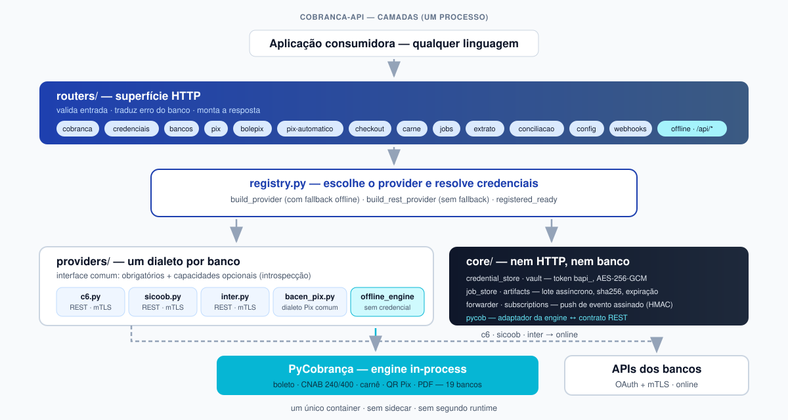
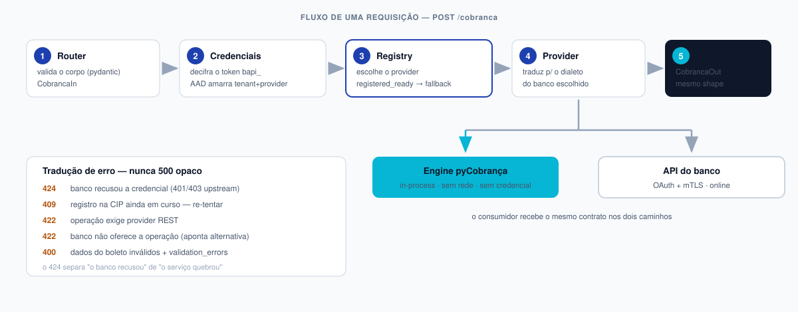

# Arquitetura da Cobranca-API

> **Versão:** 2.1.0 — serviço único, 100% Python.

Como o serviço é montado por dentro: camadas, módulos, fluxo de uma
requisição e as decisões que explicam por que está assim.

<p align="center">
  
</p>

---

## Duas superfícies, um processo

A aplicação expõe **duas superfícies** na mesma URL e no mesmo processo:

| | **Gateway** (raiz) | **Offline** (`/api/*`) |
|---|---|---|
| O que faz | REGISTRA a cobrança na API do banco | GERA o documento localmente |
| Depende de | rede + credencial do banco | nada — roda in-process |
| Autenticação | token `bapi_` | nenhuma (por design) |
| Swagger | `/docs` (OAS 3.1, gerado pelo FastAPI) | `/api/docs` (OAS 3.0, `docs/openapi.yaml`) |

O caminho offline é servido pela engine
[pyCobrança](https://github.com/Maxwbh/pyCobranca) **dentro do processo** —
sem sidecar, sem HTTP interno, sem segundo runtime.

> As rotas `/api/*` usam `include_in_schema=False`: elas não entram no OpenAPI
> do gateway porque têm spec própria. É de propósito, não esquecimento — quem
> mexer nelas precisa atualizar `docs/openapi.yaml` à mão (o CI valida a spec, e
> `postman/check_coverage.py` mantém um inventário explícito dessas rotas).

---

## Camadas

```
routers/       HTTP: valida entrada, traduz erro, monta resposta
   ↓
registry.py    escolhe o provider e resolve credenciais
   ↓
providers/     um dialeto por banco, atrás de uma interface comum
   ↓
core/          cofre, jobs, artefatos, push de eventos, engine
```

A regra que mantém isso honesto: **router não fala com banco, provider não
fala com HTTP do cliente.** Cada camada só conhece a de baixo.

### `routers/` — a superfície HTTP

| Router | Rotas | Papel |
|---|---|---|
| `cobranca` | `/cobranca` | Boleto: emitir, consultar, alterar, PDF, baixar |
| `credenciais` | `/credenciais` | Tokenização `bapi_` |
| `bancos` | `/bancos` | Catálogo e capacidades **por introspecção** |
| `pix` | `/pix` | Pix BACEN (cob/cobv, lote, recebidos) |
| `bolepix` | `/bolepix` | Boleto híbrido com QR Pix (exclusivo C6) |
| `checkout` | `/checkout` | Link de pagamento com cartão — **modo link**, sem dado de cartão aqui |
| `pix_automatico` | `/pix-automatico` | Recorrência, autorização, ciclo |
| `extrato`, `conciliacao` | `/extrato`, `/conciliacao` | Extrato PJ e C6 Pay |
| `carne` | `/carne` | Carnê 3 vias A4 |
| `jobs` | `/jobs/*` | Lote assíncrono (boletos e CNAB) |
| `webhook_banco` | `/config/webhook-*` | Cadastro da URL de notificação **no banco** |
| `webhooks` | `/webhooks/*` | ENTRADA das notificações do banco |
| `offline` | `/api/*` | Superfície offline (engine in-process) |

### `registry.py` — o roteador de providers

Decide **quem** atende e **com quais credenciais**:

```python
build_provider(...)        # com fallback offline quando o banco não está pronto
build_rest_provider(...)   # SEM fallback — Pix/conciliação só existem online
```

Dois detalhes que não são óbvios:

- **`registered_ready()`** — enquanto a cobrança registrada de um banco não está
  homologada, o `/cobranca` cai no caminho offline em vez de falhar. Liga-se por
  banco com `C6_REGISTERED_READY=true`.
- **`eh_offline()`** — um único ponto decide se o provider é offline. As rotas
  REST usam `build_rest_provider`, que barra o offline com 422 em vez de deixar
  a chamada seguir sem provider válido.

### `providers/` — um dialeto por banco

`BankProvider` (`base.py`) define o contrato. Métodos obrigatórios
(`registrar`, `consultar`, `baixar`) são `@abstractmethod`; o resto é
**capacidade opcional** — quem não implementa, simplesmente não tem o método.

É por isso que `GET /bancos` reporta capacidades **reais**: ele compara o
método da classe com o da base e só lista o que foi de fato sobrescrito. Nada
de lista manual que envelhece.

> O contrapeso disso: quem chama um método opcional **precisa checar antes**.
> Um `getattr` direto num provider que não implementa vira `AttributeError` →
> 500. Ver `exige_capacidade()` em `routers/_capacidades.py`, usado por
> `webhook_banco` e `bolepix`: responde 422 apontando a alternativa.

| Provider | Cobre |
|---|---|
| `c6.py` | C6 Bank — boleto, Pix, Bolepix, Pix Automático, extrato, C6 Pay, webhooks |
| `sicoob.py` | Sicoob — boleto, Pix, Pix Automático, extrato (mensal) |
| `offline_engine.py` | `PyCobrancaProvider` — engine local, sem credencial |
| `bacen_pix.py` | Dialeto Pix comum (BACEN) reaproveitado pelos bancos REST |

### `core/` — o que não é HTTP nem banco

| Módulo | Responsabilidade |
|---|---|
| `pycob.py` | Adaptador engine ↔ contrato REST (nomes de campo, sublotes CNAB, lote resiliente, leitura de OFX) |
| `credential_store.py` | Token `bapi_`: AES-256-GCM com chave derivada do próprio token |
| `vault.py` | Credenciais por tenant via ambiente (`VAULT__*`) |
| `job_store.py` | Estado dos jobs (SQLite ou Postgres), idempotência |
| `artifacts.py` | Artefatos em disco com `sha256` e expiração |
| `forwarder.py` | Push do evento normalizado, assinado em HMAC-SHA256 |
| `subscriptions.py` | Qual consumidor recebe os eventos de cada tenant |

---

## Fluxo de uma requisição

<p align="center">
  
</p>

`POST /cobranca` com `Authorization: Bearer bapi_...`:

1. **Router** valida o corpo (`CobrancaIn`, pydantic).
2. **`resolve_request_credentials`** decifra o token. O AAD amarra
   tenant+provider — token de outro banco dá **403**, e isso é comportamento
   correto, não bug.
3. **`registry`** escolhe o provider (ou cai no offline, ver `registered_ready`).
4. **Provider** traduz para o dialeto do banco e chama a API — ou, no caminho
   offline, chama a engine direto.
5. Resposta normalizada (`CobrancaOut`): **o mesmo shape para qualquer banco**.

### Erros

Um handler central em `main.py` traduz o erro do **upstream**, para o
consumidor nunca receber um 500 opaco por causa do banco:

| Situação | Resposta |
|---|---|
| 401/403 do banco | **424** com `upstream.status` e `upstream.body` |
| Registro na CIP em curso | **409** (o chamador re-tenta) |
| Operação exige provider REST | **422** |
| Banco não oferece a operação | **422**, apontando a alternativa |
| Dados de boleto inválidos | **400** com `validation_errors` |

> O **424** é o que diferencia "o banco recusou" de "o serviço quebrou". Sem
> ele, uma credencial vencida viraria 500 e mandaria você caçar bug no lugar
> errado. A janela de horário do sandbox C6 aparece exatamente assim.

---

## Jobs em lote

Volume alto não cabe numa requisição síncrona. `POST /jobs/boletos` responde
**202** com `job_id` e processa em background:

- **Isolamento por item** — a falha de um não cancela o lote
  (`partially_completed`); cada item guarda `item_id`, `status` e `errors`.
- **Idempotência** — `Idempotency-Key` + `external_id`; repetir não duplica.
- **Artefatos** — PDF por item, zip consolidado e manifesto, com `sha256` e
  expiração. Nunca base64 no corpo.
- **CNAB determinístico** — títulos são agrupados em sublotes por
  (banco, layout, convênio, carteira, conta, agência, variação, pix): um arquivo
  por combinação, sempre na mesma ordem.
- **Conclusão** — webhook assinado (HMAC) + métricas por job.

Contrato completo: [development/plano-jobs-lote.md](./development/plano-jobs-lote.md).

---

## Segurança

- **Token `bapi_`** — devolvido **uma única vez**. A chave AES-256-GCM é
  derivada do próprio token por HKDF: o servidor guarda o material cifrado, mas
  **não consegue decifrar sozinho**. Perdeu o token, perdeu o acesso — de propósito.
- **AAD** — a cifra amarra tenant+provider. Usar o token de um banco em rota de
  outro é rejeitado com 403.
- **Credenciais no request** — `credentials` no corpo (ou `X-Bank-Credentials`
  em base64) vivem só em memória: nunca são logadas nem persistidas.
- **mTLS + OAuth** — `clients/oauth_mtls.py` concentra os dois bancos; o
  certificado PKCS12 é materializado só em memória.
- **Webhook de saída** — `X-Signature: sha256=<hmac>`, validado com
  `hmac.compare_digest` (timing-safe).

---

## Estrutura de diretórios

```
gateway/app/
├── main.py            # FastAPI, tags, Swagger temático, handlers de erro
├── schemas.py         # contrato pydantic (Provider, Cobranca*, Pix*, ...)
├── registry.py        # roteamento de provider + credenciais
├── routers/           # uma superfície HTTP por assunto
├── providers/         # um dialeto por banco
├── core/              # cofre, jobs, artefatos, engine, eventos
└── clients/           # OAuth+mTLS e acesso à engine
gateway/tests/         # 315 testes
docs/openapi.yaml      # spec da superfície offline (OAS 3.0)
postman/               # 128 requests com IDs de rastreabilidade
```

---

## Números

| | v2.2.0 |
|---|---|
| Linguagem | 100% Python |
| Processos no container | 1 |
| Módulos Python (`gateway/app`) | 39 |
| Linhas em `gateway/app` | ~6.560 |
| Providers REST | 3 (C6, Sicoob, Inter) |
| Bancos no caminho offline | 18 |
| Rotas online (`/docs`) | 66 |
| Testes do gateway | 387 |
| Requests na regressão Postman | 128 |

---

## Onde continuar

| Assunto | Documento |
|---|---|
| Guias por banco | [development/](./development/) |
| Jobs em lote | [development/plano-jobs-lote.md](./development/plano-jobs-lote.md) |
| Campos do boleto | [fields/README.md](./fields/README.md) |
| Engine | [PyCobrança](https://github.com/Maxwbh/pyCobranca) |

---

**Mantido por:** Maxwell da Silva Oliveira ([@maxwbh](https://github.com/maxwbh)) — M&S do Brasil LTDA
