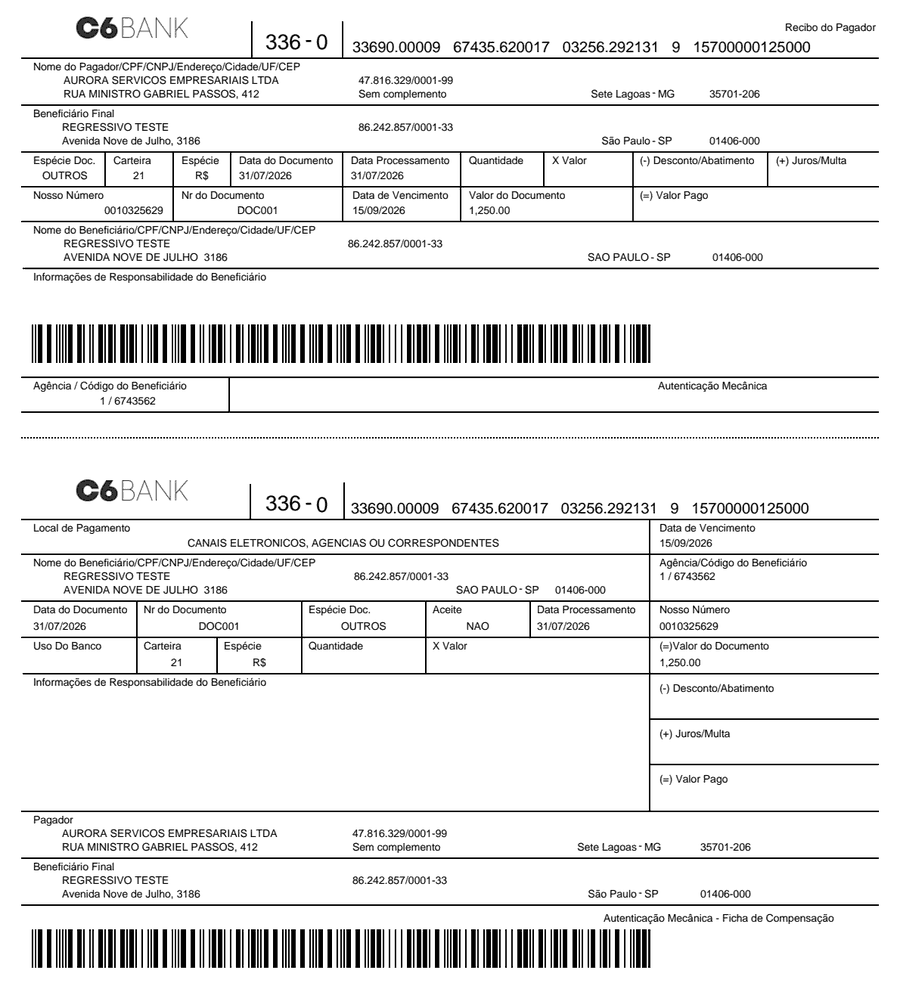
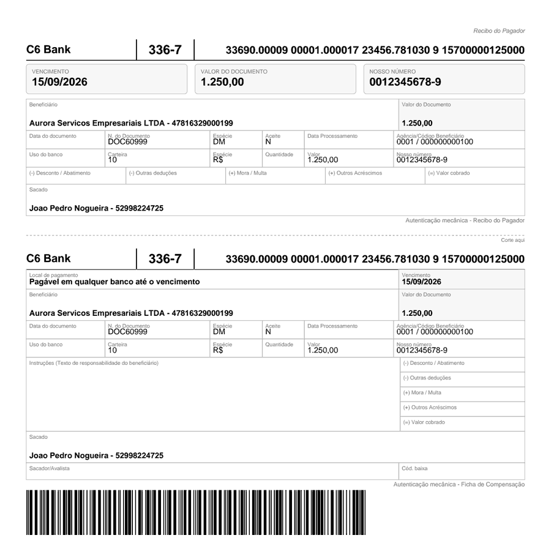
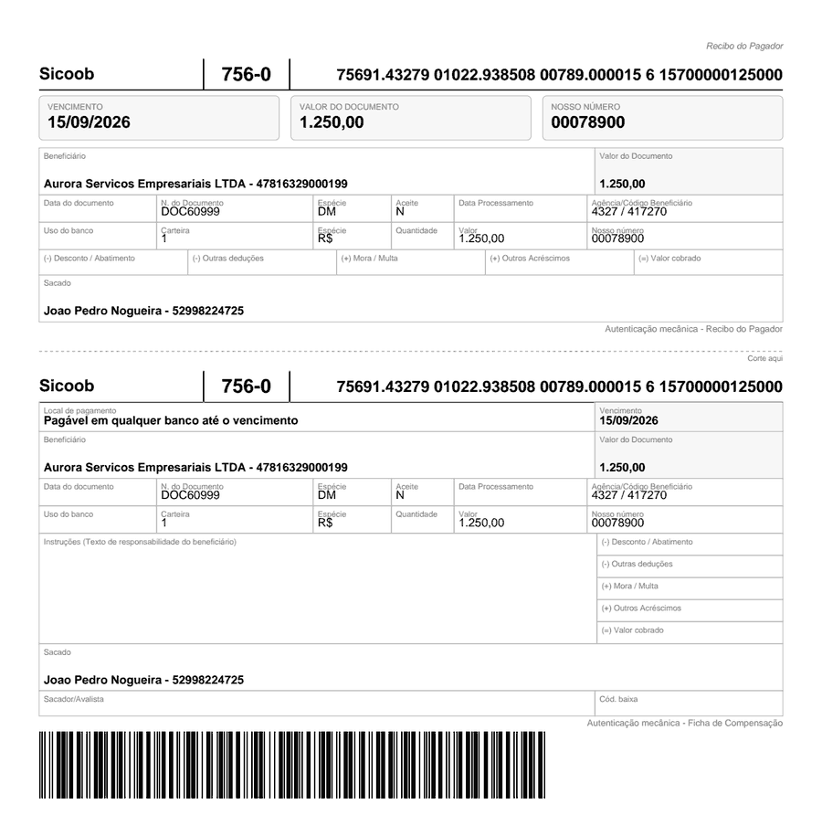

# Boleto online × offline — C6 e Sicoob lado a lado

Os dois caminhos entregam um boleto pagável. O que muda é **quem manda nos
dados** e **quem responde pelo título**. Os documentos e números abaixo saíram
de execuções reais contra os sandboxes dos bancos e contra a engine, com o mesmo
payload: R$ 1.250,00, vencimento 15/09/2026, pagador `47.816.329/0001-99`.

## Em uma frase

| | Online (API do banco) | Offline (engine PyCobrança) |
|---|---|---|
| Rota | `POST /cobranca` com `provider=c6|sicoob` | `GET /api/boleto?bank=...` |
| Quem gera o documento | **o banco** | **a engine, no processo** |
| Quem atribui o nosso número | o banco | você |
| O título existe na CIP? | **sim** — registrado, conciliável, baixável | não até a remessa CNAB ser processada |
| Precisa de credencial? | sim (OAuth + mTLS, ou token) | não |
| Rede | chamada externa por request | nenhuma |

## Boleto C6 emitido pelo banco (online)

`POST /cobranca` → **`200`**, título registrado no sandbox do C6:

```
id              01KYWQBWQPGE78NCVHPZYFEH4Y
nosso_numero    0010325629          ← atribuído pelo BANCO
linha_digitavel 33690.00009  67435.620017  03256.292131  9  15700000125000
codigo_barras   33699157000001250000000067435620010325629213
pdf             13.089 bytes, desenhado pelo C6
```



Repare no **beneficiário**: `REGRESSIVO TESTE — 86.242.857/0001-33`, com
endereço em São Paulo. Não foi enviado no payload. O banco preenche a partir da
**conta cadastrada** — no caminho online, o beneficiário é quem você é lá, não
quem você declara. A agência/código (`1 / 6743562`) segue a mesma regra.

## Boleto C6 gerado pela engine (offline)

`GET /api/boleto?bank=banco_c6` → **`200`**, PDF direto, sem rede:

```
nosso_numero     12345678 → 0012345678-9   ← DV calculado por nós
linha_digitavel  33690.00009  00001.000017  23456.781030  9  15700000125000
codigo_barras    33699157000001250000000000001000012345678103
pdf              5.471 bytes
```



Mesmo banco, mesmo valor, mesmo vencimento — e **linha digitável diferente**,
porque o campo livre carrega convênio e nosso número, que aqui são os seus. O
beneficiário é o que você mandou (`Aurora Servicos Empresariais LTDA`).

## Boleto Sicoob gerado pela engine (offline)

`GET /api/boleto?bank=sicoob` → **`200`**:

```
nosso_numero     7890 → 00078900
linha_digitavel  75691.43279  01022.938508  00789.000015  6  15700000125000
codigo_barras    75696157000001250001432701022938500078900001
pdf              5.463 bytes
```



## Sicoob online: o sandbox não emite

O sandbox do Sicoob é um **mock**. `POST /cobranca-bancaria/v3/boletos` responde
sempre `400` com o corpo de exemplo da especificação, mesmo com payload correto
e mesmo chamando o sandbox **diretamente**, sem passar por esta API:

```
{"mensagens":[{"mensagem":"string","codigo":"string"}]}
```

As leituras devolvem dado fabricado — `numeroContaCorrente: -2147483648`, datas
de 2018. Serve para validar contrato, autenticação e mapeamento de campos; não
serve para emitir. O boleto Sicoob real depende de conta em homologação ou
produção, com certificado mTLS.

## Como escolher

**Online** quando o título precisa existir no banco: cobrança que será
conciliada por retorno da CIP, baixada, alterada, ou que vira Pix híbrido com
QR do banco. É o caminho que dá liquidação rastreável — ao custo de credencial,
rede e indisponibilidade do banco.

**Offline** quando você controla a numeração e o registro sai por CNAB, ou
quando o boleto é para impressão/carnê e o registro vem depois (ou não vem, no
caso de boleto sem registro). Não autentica em banco nenhum, não faz I/O de
rede, e o mesmo payload sempre produz o mesmo documento.

> A escolha não é definitiva por instalação: as duas superfícies vivem no mesmo
> processo e na mesma URL. `provider=c6|sicoob` vai para o banco;
> `provider=pycobranca`, vazio ou a rota `/api/*` vai para a engine.

## Quando o banco recusa

No caminho online o erro do banco é **traduzido** para o que você precisa fazer,
com o corpo original preservado em `upstream` — a tabela completa está em
[gateway-python.md](./gateway-python.md#erro-que-veio-do-banco). O caso mais
comum na emissão:

```
HTTP 422
{
  "detail": "o banco recusou os dados enviados",
  "upstream": {
    "status": 400,
    "url": "https://baas-api-sandbox.c6bank.info/v1/bank_slips/",
    "body": {"detail": "[Path '/payer/address/number'] Instance type (string)
                        does not match any allowed primitive type ..."}
  }
}
```

`422` e não `502`: o payload é seu, re-tentar igual não resolve. No caminho
offline o mesmo erro sai da validação da engine, sem chamada externa.
