# Uma API REST para boleto bancário, Pix, CNAB 240/400 e OFX

**Integre 19 bancos brasileiros com um único endpoint REST.** Emissão de
boletos via API, cobrança registrada, Bolepix, Pix Automático, remessa e
retorno CNAB 240/400 e conciliação por OFX — consumido por HTTP de qualquer
linguagem: Java, PHP, C#, Node, Go, Delphi, Oracle APEX, PL/SQL ou Python.

<p class="selos">
  
  
  
  
</p>

<div class="faixa-stats" aria-label="Números do projeto">
  <div><strong>19</strong><span>bancos</span></div>
  <div><strong>1</strong><span>endpoint REST</span></div>
  <div><strong>100%</strong><span>Python · 1 container</span></div>
  <div><strong>MIT</strong><span>open source</span></div>
</div>

**Dois mundos, um contrato.** *Online*: boleto registrado, Pix, Pix Automático e
link de pagamento com cartão nas APIs dos bancos (OAuth2 + mTLS). *Offline*:
boleto em PDF, CNAB e carnê pela engine embutida — sem rede, sem convênio, sem
sidecar. É o mesmo `POST /cobranca`: **trocar de mundo é trocar um campo**.


<span class="legenda">Resposta real, capturada da API — caminho offline, sem credencial
e sem convênio. O mesmo <code>POST /cobranca</code> com <code>provider=c6</code> registra no banco.</span>

---

## Por que não integrar banco a banco?

Cada banco tem sua API, seu OAuth, seu mTLS, seu layout de CNAB e seu dialeto
de erro. A Cobranca-API existe para você integrar **uma vez**:

| | **Cobranca-API** | **Integração direta, banco a banco** |
|---|---|---|
| Contrato | **1 endpoint REST** (`POST /cobranca`) | **19 APIs diferentes** |
| Autenticação | Credencial vira token `bapi_`; OAuth+mTLS são problema nosso | OAuth, mTLS e renovação implementados N vezes |
| Trocar de banco | Trocar o campo `provider` no payload | Reescrever a integração |
| CNAB 240/400 | Unificado pela engine — remessa e retorno | Layout específico por banco e convênio |
| Erros | Normalizados (`422` payload, `424` credencial, `409` conflito…) | Um dialeto de erro por banco |
| Sem convênio ainda? | **Começa offline hoje**, liga o banco depois | Não começa |

---

## Emitir um boleto via API

Uma chamada devolve o PDF pronto:

```bash
curl -G https://cobranca-api-sq67.onrender.com/api/boleto \
  --data-urlencode 'bank=banco_brasil' \
  --data-urlencode 'type=pdf' \
  --data-urlencode 'data={"valor":1500.00,"cedente":"Empresa LTDA","documento_cedente":"11222333000181","sacado":"Joao da Silva","sacado_documento":"52998224725","agencia":"3073","conta_corrente":"12345678","convenio":"1234567","carteira":"18","nosso_numero":"123","data_vencimento":"2027-12-31"}' \
  -o boleto.pdf
```

Trocar `type=pdf` por `/validate`, `/data` ou `/nosso_numero` devolve validação e
campos calculados sem gerar o PDF.

> A instância pública roda no plano gratuito do Render e hiberna após 15 minutos
> de inatividade — a **primeira** chamada pode levar até um minuto. É ambiente de
> demonstração, não de produção, e a URL **não é fixa**: o Render a deriva do nome
> do serviço. Na sua instalação, troque pelo hostname do seu.

---

## Bancos suportados

<div class="blocos-bancos">
  <div class="bloco-banco">
    <h3>🌐 Integração online — na API do banco</h3>
    <p class="chips">
      <span class="chip chip-on">C6 Bank · 336</span>
      <span class="chip chip-on">Sicoob · 756</span>
      <span class="chip chip-on">Banco Inter · 077</span>
    </p>
    <ul>
      <li>Boleto <strong>registrado</strong> e Bolepix</li>
      <li>Pix e Pix Automático (padrão BACEN)</li>
      <li>Link de pagamento com <strong>cartão</strong> (C6)</li>
      <li>Webhook, extrato e conciliação</li>
    </ul>
  </div>
  <div class="bloco-banco">
    <h3>📦 Motor offline — engine embutida</h3>
    <p class="chips">
      <span class="chip">Banco do Brasil</span><span class="chip">Bradesco</span><span class="chip">Itaú</span><span class="chip">Santander</span><span class="chip">Caixa</span><span class="chip">Sicoob</span><span class="chip">Sicredi</span><span class="chip">Banrisul</span><span class="chip">C6</span><span class="chip">Safra</span><span class="chip">Banestes</span><span class="chip">Unicred</span><span class="chip">Ailos</span><span class="chip">+ 5</span>
    </p>
    <ul>
      <li>Boleto em <strong>PDF</strong> e carnê 3 vias</li>
      <li>Remessa e retorno <strong>CNAB 240/400</strong></li>
      <li>Parsing de <strong>OFX</strong> para conciliação</li>
      <li>Sem rede, sem convênio, sem sidecar</li>
    </ul>
  </div>
</div>

As duas listas **não se sobrepõem por acaso**, e o Inter mostra por quê: ele
fala online e **não** tem layout offline, então `provider=inter` sem credencial
responde `424` em vez de cair na engine — cair emitiria um boleto registrado no
banco errado.

A cobertura varia por recurso — em vez de repetir a lista aqui, consulte a
fonte: `GET /api/bancos` responde a matriz offline e `GET /bancos` a online,
ambas por **introspecção do código** (não há como envelhecer).

---

## Casos de uso

<div class="grade-casos">
  <div class="caso">
    <h3>🏭 ERP e financeiro</h3>
    <p>Emissão de boletos e remessas CNAB para sistemas de gestão — TOTVS,
    Senior, Sankhya, SAP, Oracle EBS — via <code>POST /cobranca</code> e
    <code>POST /api/remessa</code>, com lote assíncrono para o fechamento.</p>
  </div>
  <div class="caso">
    <h3>🔁 SaaS e assinaturas</h3>
    <p>Cobrança recorrente com boleto, carnê, Pix Automático e link de
    pagamento com cartão — e webhook assinado avisando a liquidação.</p>
  </div>
  <div class="caso">
    <h3>🅾️ Oracle APEX e PL/SQL</h3>
    <p>Integração bancária direto do banco de dados, via
    <code>APEX_WEB_SERVICE</code>/<code>UTL_HTTP</code> — com
    <a href="https://github.com/Maxwbh/cobranca-api/tree/main/examples/oracle">pacote PL/SQL</a> e
    <a href="https://github.com/Maxwbh/cobranca-api/tree/main/examples/apex">páginas APEX</a> prontos.</p>
  </div>
  <div class="caso">
    <h3>🧳 Legado e migração</h3>
    <p>Delphi, C#, Java antigo: substitui N integrações específicas por uma
    API unificada — HTTP puro, PDF em binário ou base64, sem instalar nada
    no cliente.</p>
  </div>
</div>

---

## Referência {#referencia}

| Guia | Para quê |
|---|---|
| [Gateway Python](api/gateway-python.md) | Credenciais, cobrança online, Pix, conciliação e webhooks |
| [Validação de campos](api/validacao-campos.md) | Regras por banco — tamanhos, carteiras, nosso número, CNPJ alfanumérico |
| [Encargos na remessa](api/encargos.md) | Multa, juros, desconto, IOF, abatimento e protesto no CNAB |
| [Pix em boletos](api/pix.md) | Bolepix — BR Code EMV e QR no boleto e na remessa |
| [Leitura de OFX](api/ofx-parsing.md) | Extrato v1/v2 e conciliação com os boletos emitidos |
| [Troubleshooting](api/troubleshooting.md) | Erros comuns e o que significam |
| [Arquitetura](ARCHITECTURE.md) | Como as peças se encaixam |
| [Guia de deploy](deploy.md) | Imagem no GHCR, Render, variáveis de ambiente e troubleshooting |
| [Notas de engenharia](development/) | Roadmap de providers e o guia de integração de cada banco |

A referência completa e sempre atualizada é o **Swagger servido pela própria
API** — ele reflete o código em execução, não uma cópia que pode envelhecer.

---

## Como rodar

Imagem pronta, publicada a cada release no GitHub Container Registry — sem
clonar e sem buildar:

```bash
docker run -p 8000:8000 -e LOG_LEVEL=info ghcr.io/maxwbh/cobranca-api:latest
```

Em produção, fixe a versão (`ghcr.io/maxwbh/cobranca-api:2.2.0`) em vez de
`latest`. Para mexer no código, o caminho é o clone:

```bash
git clone https://github.com/Maxwbh/cobranca-api.git
cd cobranca-api
docker build -t cobranca-api .
docker run -p 8000:8000 -e LOG_LEVEL=info cobranca-api
```

Um `Dockerfile`, um processo, sem sidecar. O
[guia de deploy](deploy.md)
cobre o Render.com e as variáveis de ambiente — inclusive os tetos de lote
(`LOTE_MAX_ITENS`, `JOB_MAX_ITENS`) e o que muda ao subir de plano.

<div class="cta-final">
  <h2>Teste a API agora</h2>
  <p>Suba o container e emita o primeiro boleto em menos de 5 minutos —
  sem convênio, sem credencial, sem cadastro.</p>
  <p>
    <a class="btn btn-primario" href="https://cobranca-api-sq67.onrender.com/docs">Testar no Swagger</a>
    <a class="btn" href="https://github.com/Maxwbh/cobranca-api">Ver no GitHub</a>
  </p>
</div>

Projeto sob licença MIT. A engine de cálculo e renderização é a
[pyCobrança](https://github.com/Maxwbh/pyCobranca), também open source.

## Quem faz

Desenvolvido por **[Maxwell da Silva Oliveira](https://www.linkedin.com/in/maxwbh)**
([GitHub](https://github.com/Maxwbh) · [maxwbh@gmail.com](mailto:maxwbh@gmail.com)),
da **[M&S do Brasil LTDA](https://msbrasil.inf.br)** — consultoria e
desenvolvimento em integração bancária, Oracle APEX e Python.

Precisa de ajuda para integrar a Cobranca-API ao seu ERP, Oracle APEX ou
sistema legado? [Fale com a gente](https://msbrasil.inf.br).
